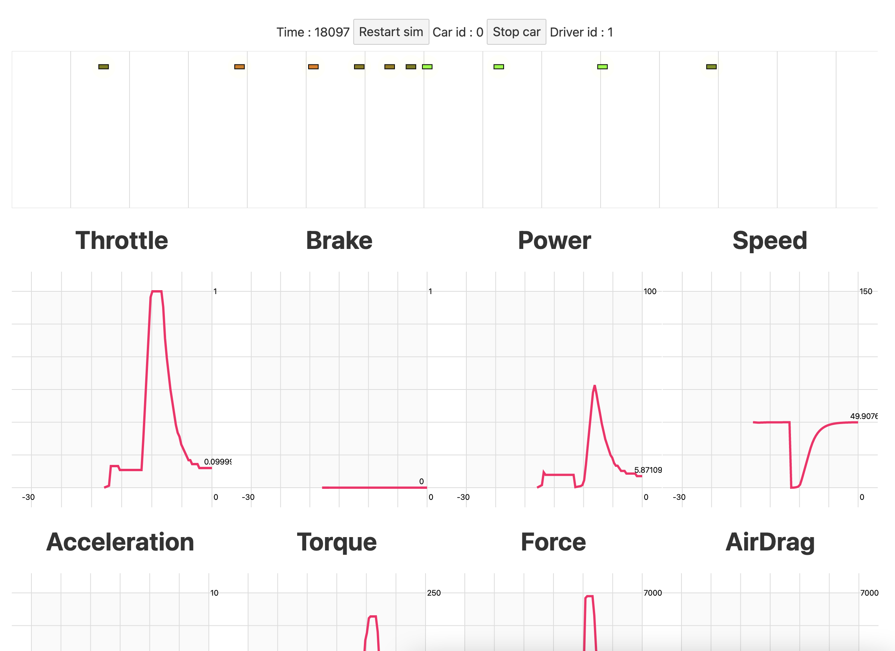

## What is it

Traffic analyst is a simulation of a line of car traffic. It represent how traffic can slow down and create traffic jam without any more obstacle (traffic waves), and how driver behavior can have an impact on this.

## Install

```
npm install
```

## Launch

```
npm run dev
```

## Test

```
npm run test
npm test -- src/logic/carLogic/carlib.test.js # single test
```


## Screenshot



## Misc

Built using svelte, typescript, jsdoc

Tags :
Rule 184, stop waves

Useful websites :
zeperfs.com
www.auto-data.net
tirecalculator.com
taille-pneu.com
www.auto-abc.eu/


## Contrib

### Art

#### Blender

Origin point of the car body on the wheel level and centered
Empty for each wheel named Wheel#R or Wheel#L
Shade smooth
Auto Smooth around 20°
Modeling steps :
- Start by making a box of the size of the car
- Align the blueprints to the box (Front of the car is -Y)
- Model with symetry modifier applied on X axis `body`
- Define texture seam `cmd+E`
- Apply material + base color texture with closest setting (pixelatted look)
- Create a texture of size `256x256` for a basic car size
- Unwrap the texture `U` and use the plugin `Texel Density Checker by mrven` to scale the uv map (Texture size `256` TD `0.33` set my td)
- Model the wheel with a cylinder with a
- Place the wheels empty on each side name them depending on the side `wheel1R` `wheel2L` (could do it with empty rotation but harder to see)
- Move origins so the car `Body` origin is at wheel center level and reset position to 0
- Using gltf exporter -> Export the `Body` + `MiscObj` + `Wheel1R` empties (selection only) (mesh -> apply mirror modifier)
- Export the wheel base model


#### Pixel scale

1m50 -> 50 pixels
1m -> 33.3 pixels
1cm -> 0.33 pixels

#### Texture

If using blueprint as base -> measure their length in pixel & car pixel length `lmm * 0.033` to resize it

Use the crow color palette

First 5 pixels define the colors palette than can be altered to change the car color
1 : base
2 : darker
3 : lighter
4 : darker+
5 : lighter+

#### 2D Scene

1cm -> 0.1 pixel